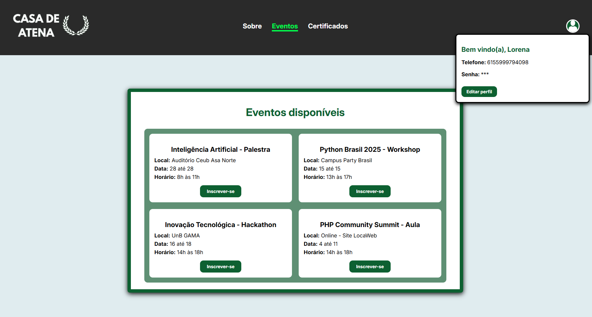

# 🏛️ CASA DE ATENA 🏛️
### Sistema de Gerenciamento de Eventos Acadêmicos ###

Sistema web para gestão de eventos acadêmicos e emissão de certificados.  
Permite o cadastro e autenticação de usuários, criação e inscrição em eventos, além da geração de certificados para os participantes.

### Desenvolvedores
- **👤💻 [okiobot (Mateus Rodrigues)](https://github.com/okiobot)**
- **👤💻 [corvinyy (Lorena Araujo)](https://github.com/corvinyy)**
- - **👤💻 [devlucasaf (Lucas Freitas)](https://github.com/devlucasaf)**

## 📸 PREVIEW (Projeto em progresso!)

## 🛠️ Status

⚙️ Em progresso

## ✨ Funcionalidades

- 👥 Cadastro e autenticação de usuários (alunos, professores, organizadores)
- 🗓️ Criação e gerenciamento de eventos (informações como tipo de evento, data, horário, quantidade de participantes)
- 📝 Inscrição de usuários em eventos
- 🎓 Emissão de certificados para participantes
- 🛠️ Aplicação de boas práticas de desenvolvimento (MVC com Django, documentação)

---

### 🛠️ Ferramentas e Tecnologias

  

---

### Feito com ❤️ e 😡
